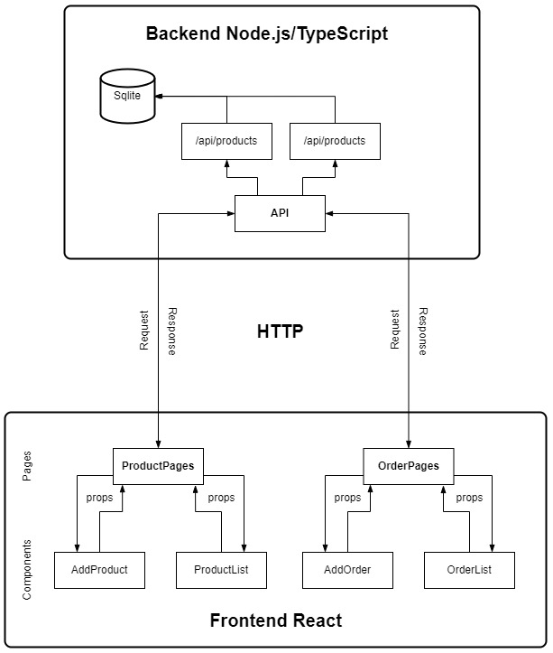
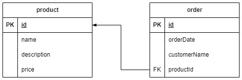

# Documentación de la Aplicación

## Arquitectura de la Aplicación

La aplicación está dividida en dos partes principales: el **frontend** desarrollado en React/Tailwind y el **backend** en Node.js con TypeScript. Se comunican a través de una API REST utilizando peticiones HTTP.

## Esquema de la Base de Datos

### Entidades

- **Producto**: Contiene información sobre los productos disponibles.
- **Orden**: Registra las órdenes realizadas por los clientes.

### Relaciones

- Un producto puede estar asociado con múltiples órdenes (relación 1 a N).